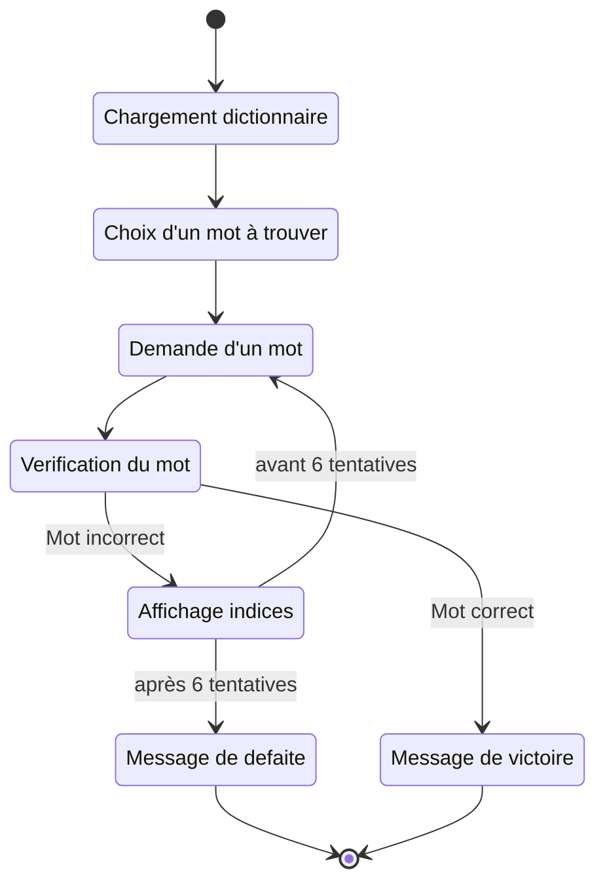

# Projet Wordle IN104

Cette repository contient le code du projet du cours IN104 de l'ENSTA Paris. Ce projet consiste à creer un jeu wordle en console puis de tenter de faire une intelligence artificielle capable d'y jouer.

## Comment jouer ?

Pour jouer au jeu, il vous faudra cloner cette repo puis compiler le jeu ! 

```
git clone https://github.com/Seb-sti1/wordle wordle
cd wordle
gcc *.c -o wordle.out -lm
./wordle.out
```

Ensuite c'est tout simple : vous devez devinez un mot de 5 lettres en 6 essais. A chaque essai le programme vous donne des indices : les lettres vertes correspondent aux lettres bien placées, les lettres jaunes correspondent aux lettres existantes dans le mot mais au mauvaise endroit et en blanc les lettres n'existant dans le mot.

## Comment compiler (pour développer) le jeu ?

```
git clone https://github.com/Seb-sti1/wordle wordle
cd wordle
gcc -fdiagnostics-color=always -Wall -Werror -Wfatal-errors -g *.c -o wordle.out -lm
```

## Règles du wordle


## Explications

La boucle principale du jeu est dans `main.c`. Le chargement du dictionnaire, la recherche de mot et la vérification de similarité sont effectués dans `word.c`. `bot.c` se charge de trouver les mots compatibles et les meilleurs mots pour chaque IA. `entropy.c` et `occurence.c` calculent les scores de chaque mot (pour trouver le meilleur). 

### Fonctionnement humain



### Fonctionnement bot


## Todo

- Faire une interface console plus jolie (regarder [ncurses](http://hughm.cs.ukzn.ac.za/~murrellh/os/notes/ncurses.html) ou [termbox2](https://github.com/termbox/termbox2))
- Creer un moyen de tester les bots sur tous les mots


## Sources

- [3Blue1Brown vidéo sur la theorie de l'information pour le wordle](https://youtu.be/v68zYyaEmEA)
- [Blog de Science Etonnante](https://scienceetonnante.com/2022/02/13/comment-craquer-le-jeu-wordle-sutom/)
- [Dictionnaire de mot anglais](https://github.com/dwyl/english-words)
- [Dictionnaire de mot créole haïtien](https://www.potomitan.info/vedrine/lexique_index.php)

## Licence

Ce programme est sous licence GNU GPL v3.0 (cf LICENSE)

*Par Sébastien Kerbourc'h et Adrien Wallon* 


