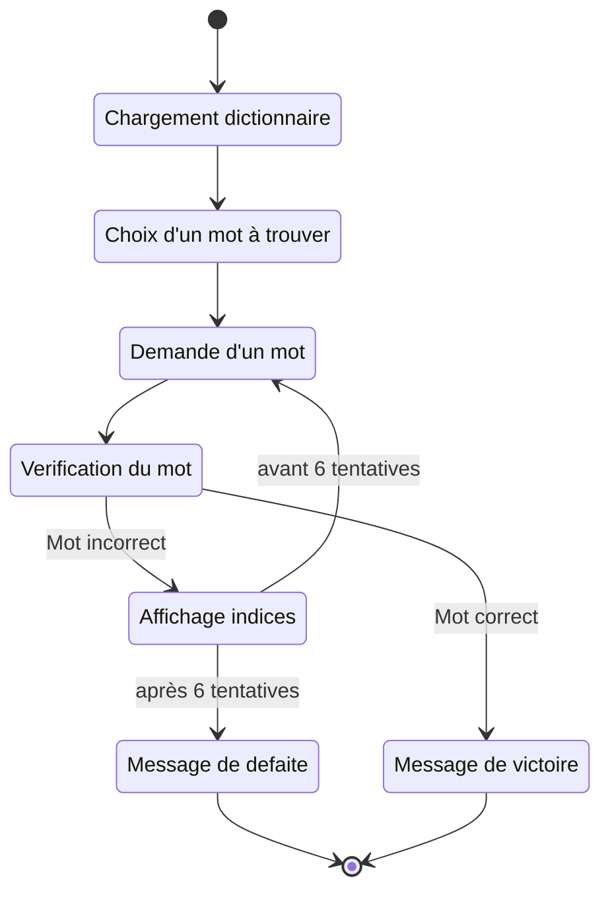
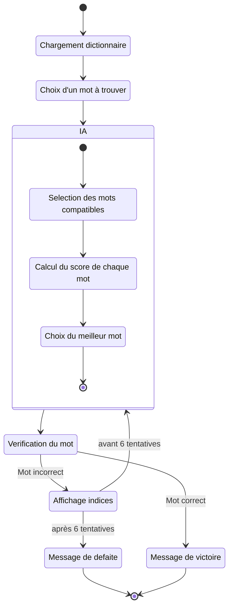

# Projet Wordle IN104

Cette repository contient le code du projet du cours IN104 de l'ENSTA Paris. Ce projet consiste à creer un jeu wordle en console puis de tenter de faire une intelligence artificielle capable d'y jouer.

## Comment jouer ?

Pour jouer au jeu, il vous faudra cloner cette repo puis compiler le jeu ! 

```
git clone https://github.com/Seb-sti1/wordle wordle
cd wordle
make
make clean
./wordle.out
```

Ensuite c'est tout simple : vous devez devinez un mot de 5 lettres en 6 essais. A chaque essai le programme vous donne des indices : les lettres vertes correspondent aux lettres bien placées, les lettres jaunes correspondent aux lettres existantes dans le mot mais au mauvaise endroit et en blanc les lettres n'existant dans le mot.

## Comment compiler (pour développer) le jeu ?

```
git clone https://github.com/Seb-sti1/wordle wordle
cd wordle
gcc -fdiagnostics-color=always -Wall -Werror -Wfatal-errors -g *.c -o wordle.out -lm
```

## Règles du wordle


## Explications

La boucle principale du jeu est dans `main.c`. Le chargement du dictionnaire, la recherche de mot et la vérification de similarité sont effectués dans `word.c`. `bot.c` se charge de trouver les mots compatibles et les meilleurs mots pour chaque IA. `entropy.c` et `occurence.c` calculent les scores de chaque mot (pour trouver le meilleur). 

### Fonctionnement humain



### Fonctionnement bot




La partie "calcul du score de chaque mot" dépend de la méthode utilisée. Nous avons développé trois méthodes :
- En utilisant des calculs d'entropies (qui traduisent le gain d'information en moyenne en jouant un certain mot)
- En utilisant la somme ou le produit de la fréquence composant un mot

## Performance

*Réalisée à partir de data.csv importé dans une base de donné sql*


bot :
* 0 : entropie corrigé
* 1 : entropie cassé
* 2 : somme fréquence
* 3 : produit fréquence

WS : taille des mots

D (dictionnaire) : 
* 0 : français
* 1 : Anglais
* 2 : créole haïtien

```
SELECT bot, wordlesize as "WS", dico as "D", AVG(temps), AVG(score) as "Mscore", 100*COUNT(word)/(SELECT COUNT(word) FROM wordle WHERE bot = 0 AND wordlesize = WS AND dico = D GROUP BY wordlesize, bot, dico) as "Taux réussite", VARIANCE(score) FROM wordle WHERE score >=0 AND score < 7 GROUP BY wordlesize, bot, dico ORDER BY bot, WS, D, Mscore ASC;

+-----+----+---+-------------------------+--------+----------------+-----------------+
| bot | WS | D | AVG(temps)              | Mscore | Taux réussite  | VARIANCE(score) |
+-----+----+---+-------------------------+--------+----------------+-----------------+
|   0 |  5 | 0 |   0.0026036499490315994 | 3.8108 |        96.7456 |          0.8266 |
|   0 |  5 | 1 |     0.03411798601774672 | 4.2579 |        93.4422 |          0.8510 |
|   0 |  5 | 2 | 0.000014698795180722894 | 2.4337 |       100.0000 |          0.2697 |
|   0 |  7 | 0 |    0.004423197455168787 | 3.2744 |        99.9341 |          0.4264 |
|   0 |  7 | 1 |    0.012550571637251734 | 3.4503 |        99.4309 |          0.4782 |
|   0 |  7 | 2 |  0.00001726785714285714 | 2.1250 |       100.0000 |          0.1451 |
|   0 | 12 | 0 |    0.007133094551471457 | 2.3667 |       100.0000 |          0.2384 |
|   0 | 12 | 1 |    0.019910382180257463 | 2.4935 |       100.0000 |          0.2567 |
|   1 |  5 | 0 |      2.6079054889173143 | 4.2928 |        92.5444 |          0.9258 |
|   2 |  5 | 0 |   0.0008008590238365492 | 4.3998 |        86.8836 |          1.0218 |
|   2 |  5 | 1 |    0.002528845353735052 | 4.9417 |        73.0716 |          0.8602 |
|   2 |  5 | 2 | 0.000010843373493975913 | 2.9157 |       100.0000 |          0.6073 |
|   2 |  7 | 0 |   0.0027643912231559227 | 3.9346 |        98.7877 |          0.7441 |
|   2 |  7 | 1 |   0.0073891346426302774 | 4.0638 |        97.4761 |          0.6946 |
|   2 |  7 | 2 | 0.000011836363636363637 | 2.3273 |        98.2143 |          0.3293 |
|   2 | 12 | 0 |    0.004538474648386708 | 2.6208 |       100.0000 |          0.3186 |
|   2 | 12 | 1 |    0.014792455656652327 | 2.9224 |       100.0000 |          0.2732 |
|   3 |  5 | 0 |   0.0006877659768023667 | 4.6320 |        86.7258 |          0.9763 |
|   3 |  5 | 1 |    0.002155371186299771 | 4.8606 |        75.5590 |          0.9779 |
|   3 |  5 | 2 | 0.000010072289156626512 | 2.9036 |       100.0000 |          0.8100 |
|   3 |  7 | 0 |    0.002719096628316839 | 3.8976 |        99.0710 |          0.7201 |
|   3 |  7 | 1 |     0.00765785670814002 | 3.9447 |        97.0260 |          0.7525 |
|   3 |  7 | 2 | 0.000009267857142857144 | 2.2679 |       100.0000 |          0.2318 |
|   3 | 12 | 0 |    0.004154733483039839 | 2.7499 |       100.0000 |          0.3095 |
|   3 | 12 | 1 |    0.015305027536480742 | 2.8293 |       100.0000 |          0.3185 |
+-----+----+---+-------------------------+--------+----------------+-----------------+
```

```
SELECT wordlesize, dico, COUNT(word) FROM wordle WHERE bot = 0 GROUP BY wordlesize, bot, dico;

+------------+------+-------------+
| wordesize  | dico | COUNT(word) |
+------------+------+-------------+
|          5 |    0 |        5070 |
|          5 |    1 |       15920 |
|          5 |    2 |          83 |
|          7 |    0 |       15178 |
|          7 |    1 |       41998 |
|          7 |    2 |          56 |
|         12 |    0 |        8461 |
|         12 |    1 |       29125 |
+------------+------+-------------+
```

```
SELECT bot, wordlesize as "WS", dico as "D", score, COUNT(word) FROM wordle WHERE score>=0 AND score<7 AND bot=0 GROUP BY wordlesize, dico, score ORDER BY wordlesize, dico, score ASC;

+-----+----+---+-------+-------------+
| bot | WS | D | score | COUNT(word) |
+-----+----+---+-------+-------------+
|   0 |  5 | 0 |     1 |           1 |
|   0 |  5 | 0 |     2 |         195 |
|   0 |  5 | 0 |     3 |        1746 |
|   0 |  5 | 0 |     4 |        1994 |
|   0 |  5 | 0 |     5 |         727 |
|   0 |  5 | 0 |     6 |         242 |

|   0 |  5 | 1 |     1 |           1 |
|   0 |  5 | 1 |     2 |         207 |
|   0 |  5 | 1 |     3 |        2772 |
|   0 |  5 | 1 |     4 |        6378 |
|   0 |  5 | 1 |     5 |        4011 |
|   0 |  5 | 1 |     6 |        1507 |

|   0 |  5 | 2 |     1 |           1 |
|   0 |  5 | 2 |     2 |          45 |
|   0 |  5 | 2 |     3 |          37 |

|   0 |  7 | 0 |     1 |           1 |
|   0 |  7 | 0 |     2 |        1098 |
|   0 |  7 | 0 |     3 |        9363 |
|   0 |  7 | 0 |     4 |        4217 |
|   0 |  7 | 0 |     5 |         422 |
|   0 |  7 | 0 |     6 |          67 |

|   0 |  7 | 1 |     1 |           1 |
|   0 |  7 | 1 |     2 |        1504 |
|   0 |  7 | 1 |     3 |       22782 |
|   0 |  7 | 1 |     4 |       15104 |
|   0 |  7 | 1 |     5 |        1897 |
|   0 |  7 | 1 |     6 |         471 |

|   0 |  7 | 2 |     1 |           1 |
|   0 |  7 | 2 |     2 |          47 |
|   0 |  7 | 2 |     3 |           8 |

|   0 | 12 | 0 |     1 |           1 |
|   0 | 12 | 0 |     2 |        5381 |
|   0 | 12 | 0 |     3 |        3054 |
|   0 | 12 | 0 |     4 |          25 |

|   0 | 12 | 1 |     1 |           1 |
|   0 | 12 | 1 |     2 |       14845 |
|   0 | 12 | 1 |     3 |       14186 |
|   0 | 12 | 1 |     4 |          91 |
|   0 | 12 | 1 |     5 |           2 |
+-----+----+---+-------+-------------+
```


## Sources

- [3Blue1Brown vidéo sur la theorie de l'information pour le wordle](https://youtu.be/v68zYyaEmEA)
- [Blog de Science Etonnante](https://scienceetonnante.com/2022/02/13/comment-craquer-le-jeu-wordle-sutom/)
- [Dictionnaire de mot anglais](https://github.com/dwyl/english-words)
- [Dictionnaire de mot créole haïtien](https://www.potomitan.info/vedrine/lexique_index.php)

## Licence

Ce programme est sous licence GNU GPL v3.0 (cf LICENSE)

*Par Sébastien Kerbourc'h et Adrien Wallon* 


